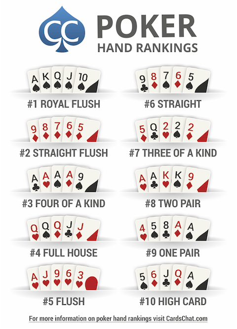

# Step 1: Identifying Personae

## The Poker Hand Kata: Problem description

This tutorial relies on a simplified version of the [PokerHand](https://codingdojo.org/kata/PokerHands/) kata, which 
itself simplifies the [TexasHoldEm](https://codingdojo.org/kata/TexasHoldEm/) one. the following text is an adaptation 
of the kata initial description.

  - A poker deck contains 52 cards. 
  - Each card has a suit which is one of clubs (:clubs:), diamonds (:diamonds:), hearts (:hearts:), or spades 
    (:spades:), denoted `C`, `D`, `H`, and `S` in the input data. 
  - Each card also has a value which is one of 2, 3, 4, 5, 6, 7, 8, 9, 10, jack, queen, king, ace (denoted `2`, `3`, 
    `4`, `5`, `6`, `7`, `8`, `9`, `T`, `J`, `Q`, `K`, `A`). 
  - For scoring purposes, the suits are unordered while the values are ordered as given above, with `2` being the lowest 
    and `A` the highest value.
  - A poker hand consists of 5 cards dealt from the deck.
    - _E.g._, `2H 3D 5S 9C KD` represents the following hand: 2:hearts: 3:diamonds: 5:spades: 9:clubs: King:diamonds:
  - Hands are entered using the command line (`stdin`).

**The objective of this kata is to identify the best combination of cards available in a given hand, and for a game 
composed of multiple players to identify the winner.** Combinations are ranked according to the following order:

## :fast_forward: Exercise

  1. Identify the personae involved in this kata.
  2. For each persona, define:
      - Her/His name;
      - Her/His biography (couple of lines);
      - Her/His goals with respect to the developed system
    
   
  * Next step: [Writing epics and stories](./step2.md)