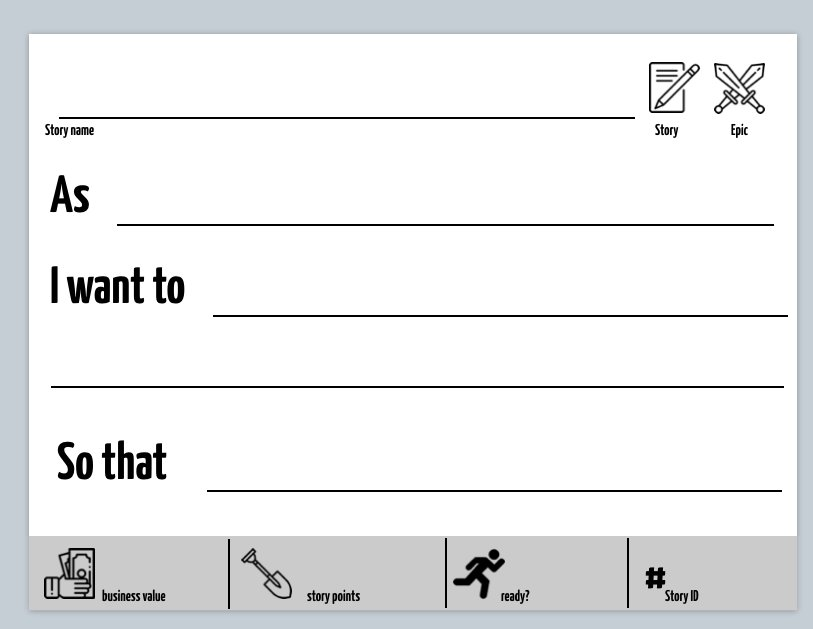
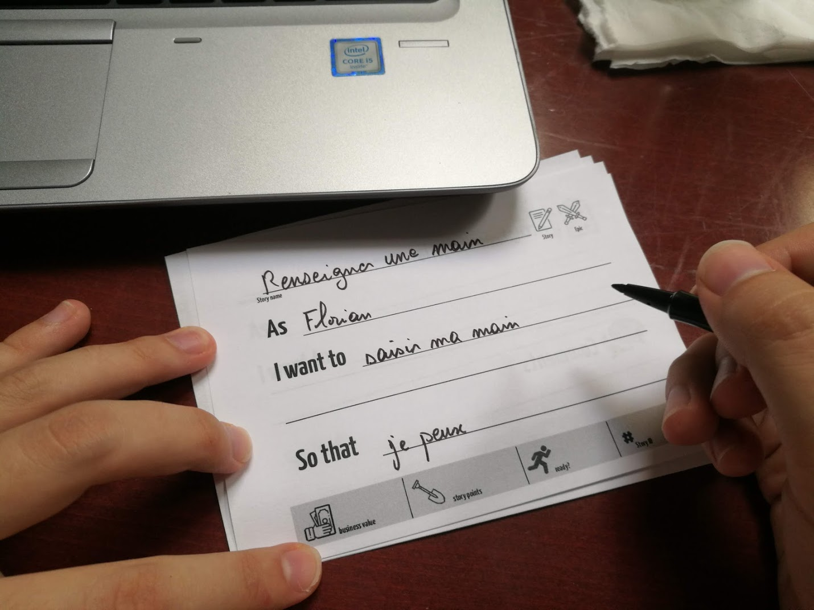
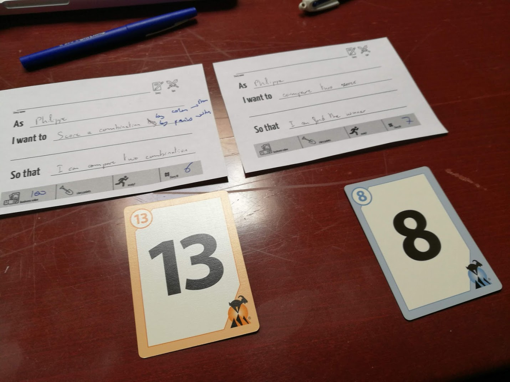

# Step 2: Writing epics and stories

  * Previous step: [Identifying personae](./step1.md)

## Possible Personae involved

For the next steps of the tutorial, we will rely on the following personae:

  - **Bob**: _a poker player_.
    - Biography: Bob is 28 years old, and lives in a suburban residential area. He plays poker with friends at home, 
        and dream to visit Las Vegas one day and participate to a large tournament. He consider himself as an 
        average-plus player, and trains a lot on the Internet to prepare himself for a _big_ tournament.
    - Goal: His main goal is to improve himself when gambling, by learning how to exploit at its best a given hand.
  - **Alice**: _a croupier_.
    - Biography: Alice is 32 years old. She works as a Poker croupier in a small casino located in Nevada. She is not 
        really a big fan of Poker and consider it a boring game from her croupier point of view. She would prefer to 
        work on Blackjack tables, which require more attention and reactivity from the croupier. She fears to make a 
        mistake with the cards and be accused of cheating (thus losing her job).
     - Goal: Her main goal is to rely on an automated tool that will ensure the absence of cheaters and secure her 
        position even when she is not 100% attentive to the game.

:zap: These personae are not exhaustive, and can be refined into more specialized ones (especially Bob).

## Identifying Epics

The epics have to be related to Alice and Bob. For each epic, you need to:
 
   1. use a blank story card, and give your epic a name;
   2. fill the given template: "_As ..., I want to ... so that ..._"l
   3. Circle the upper right _epic_ symbol to differentiate it from the upcoming stories;
   4. Leave the other parts of the card empty (they will be usefull with fine-grained stories)
   

### :bangbang: Exercise

  - Identify a couple of epics related to Alice and Bob.
  - What is the link between epics and personae's description? 

## Refining Epics into Stories

It is now time to refine your epics into stories. Remember stories are an _INVEST_ ment, and even if the goal of this 
tutorial is not to write _good_ stories, we will keep on the fundamentals:

  - _Independent_: business priorities might change, and stories should not be rewritten to support this;
  - _Negotiable_: the only fixed element while developing a system is the _iteration backlog_. A story can be discarded 
    or rewritten if not engaged in a given iteration;
  - _Valuable_: A story brings value to a given persona, to support continuous delivery of value to the customer;
  - _Estimable_: A story can be estimated according to different dimensions. In this tutorial we focus on 
  - _Small_: by writing small stories, you will be able to engage multiple (independent) stories in an iteration 
    backlog and reduce the impact of non-delivery for example. 
  - _Testable_: A test will allow one to determine if a story is _DONE_ or not.

To be _Ready_, a story must be correctly estimated, and its acceptance criteria section (verso) filled.

### :bangbang: Exercise

  - Define your product backlog by refining your epics into independent, valuable and testable stories. 
  - How to maintain the _Independence_ property in the backlog?
  - What about the _Value_? How does personae help?

## Estimating stories

During the previous exercise, we focused on independence, value and testability. But in order to be ready, a story must 
also be estimated. We will use [poker planning cards](../../organizers/agile_planning_pokerA4RV.pdf) as a consensus 
method to support story estimation. 

For time reasons we will not go into a full planning poker session, but instead rely on the cards to exemplify the 
(lack of) consensus inside a given backlog.

### :bangbang: Exercise

  - Select the stories you think the more valuable for the first development sprint, creating your _iteration backlog_;
  - For each story, use poker-planning cards to see if both member of the group agree on the technical risk (story 
    points) and business value estimation

  * Next step: [Implementing stories & Tests](./step3.md)