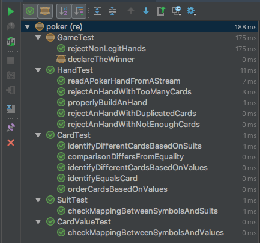

# Step 3: Implementing stories & Tests

  * Previous step: [Writing epics and stories](./step2.md)

## Iteration Backlog

the rationale of ou first iteration is to develop a Minimal and Viable Product. As a consequence, we engaged stories 
that allows a player to submit the contents of his hand, detects the easiest combination (_Highest Card_, HC) and 
declares a winner. We also engaged a story related to Alice's fear of having cheaters at her table, as it has a lot of 
value for this persona. 

We consider here the following iteration backlog.

  1. As Bob, I want to enter my hand on the command line so that the game knows the contents of my hand;
      - Story points: 8
      - Business value: 40 
      - Acceptance scenario: One enters a regular hand according to the input syntax. The system echoes as output the 
        contents of the submitted hands in understandable terms (_e.g._, `QD` :twisted_rightwards_arrows: _Queen of 
        Diamonds_)
  2. As Alice, I want to identify cheaters that trick the card deck so that I can report cheating attempts to management
      - Story points: 20
      - Business value: 13
      - Acceptance scenario: One enters two overlapping hands (_e.g._ the two hands contains a `QD`). The 
        game echoes an error stating it encountered a cheat attempts.
  3. As Bob, I want to know which is the highest card in my hand so that I can know the value of the HC combination
      - Story points: 1
      - Business value: 0,5
      - Acceptance scenario: One enters an hand. The value of its highest card is printed on screen.
  4. As Alice, I want to compare two hands according to the HC combination so that I can identify the winner
      - Story points: 3
      - Business value: 3
      - Acceptance scenario: One enters two hands. The winning hand according to the HC combination is printend on 
        screen
  5. As Alice, I want to identify ex æquo hands in a given round so that I can declare the _tie_ situation.
      - Story points: 13
      - Business value: 40
      - Acceptance scenario: One enters two ex æquo hands. The system declares a _tie_.

The Kanban board of the team looks like the following today:


| TO DO | IN PROGRESS | DONE  |
| :---: | :---:       | :---: |
| #4    |  #3         |  #1   |
| #5    |             |  #2   |  


## Running the existing product

According to the Kanban board, our development team had already started the development. First of all, you have to 
clone this repository on your computer: 

    azrael:~ mosser$ git clone https://github.com/mosser/agile-tutorial.git
    azrael:~ mosser$ cd agile-tutorial
    azrael:agile-tutorial mosser$

To compile the existing code, you simply have to invoke Maven from the command line, asking the build tool to 
first `clean` your environment and then `package` it. We will skip tests for now, as we focus on the business code.

    azrael:agile-tutorial mosser$ mvn -DskipTests clean package

The previous command should end by printing `BUILD SUCCESS` to the standard output. It produced a file named 
`poker-game.jar` that contains an executable version of the poker game. To run the game, simply asks java to do so:

    azrael:agile-tutorial mosser$ java -jar target/poker-game.jar 
    Enter 1st player hand: QD QH KC KH 3S
    1st: [KING of HEARTS, QUEEN of DIAMONDS, THREE of SPADES, QUEEN of HEARTS, KING of CLUBS]
    Enter 2nd player hand: 7S 6H 4S 3D 2C
    2nd: [FOUR of SPADES, SEVEN of SPADES, TWO of CLUBS, SIX of HEARTS, THREE of DIAMONDS]
    Exception in thread "main" java.lang.UnsupportedOperationException: Cannot determine winner!
            at re.poker.Game.declareWinner(Game.java:23)
            at re.poker.Main.main(Main.java:22)

### :bangbang: Exercise

  - Stories #1 and #2 are considered _DONE_ by the team. Can you validate this statement by using the product? 

## Developing the product

### :rotating_light: Implementation status

  - The game is developed in the `src/main/java` directory, in a package named `re.poker`;
  - The `Main` class contains the UI, asking for two hands, printing the hands to `stdout` and trying to determine the 
    winner of the game;
  - The `cards` subpackage defines an `Hand` as a set of `Card`s. A `Card` is a tuple containing a `CardValue` and a 
    `Suit`. Both values and suits are represented as enumerated types to simplify the input parsing;
  - The `Card` class implements the `Comparable` interface: `card1.compareTo(card2)` returns a negative number if 
    `card1` < `card2`, `0` if they have the same value, and a positive number otherwise. Be careful that in this case 
    having the same value does not means being equals : 
      - 2:spades:`.equals(`2:hearts:`) != true`, but
      - 2:spades:`.compareTo(`2:hearts:`) == 0`
  - The `Game` class collects hands from players, assess their legitimacy and identify the winning one;
  - The `Helpers` class contains static hands ready to be used for tests purpose.

### :bangbang: Exercise

  - Fix the `Main` class to print the highest card of each collected hand, so that story #3 can be considered as _DONE_;
    - :unlock: Hint: As (i) the `Card` class implements `Comparable` and (ii) `Hand` is basically defined a set of cards, 
      one can rely on the `Collections::max` static method. Let `h` an `Hand`, `Collections.max(h.getCards())` returns 
      its highest card.
  - Update the `Game` class to support the business logic of story #4.
    -  :unlock: Hint: The winner here is the owner of the highest card of all hands.

<details>
  <summary>Click to expand code solution (<tt>Main.java</tt>)</summary>

```java
// ...
System.out.print("Enter 1st player hand: ");
Hand first = new Hand(System.in);
System.out.println("1st: " + first);
System.out.println("  Highest card: " + Collections.max(first.getCards()));
theGame.submit("1st", first);
// ...
```

</details>


<details>
  <summary>Click to expand code solution (<tt>Game.java</tt>)</summary>

```java
public String declareWinner() {
    if (hands.isEmpty())
        return "No winner if no players!";
    return winnerByHC().getKey();
}

public Map.Entry<String, Hand> winnerByHC() {
    Card max = hands.values().stream()
                .map(Hand::getCards).flatMap(Set::stream).max(Card::compareTo).get();
    return hands.entrySet().stream()
            .filter(e -> e.getValue().getCards().contains(max))
            .findFirst().get();
}
```

</details>

## Testing the product

### :rotating_light: Implementation status

  - The development team has created a test suite for the product, under `src/test/java`, in the `re.poker` package.
  - To execute the test suite, run the following command:
    - `azrael:agile-tutorial mosser$ mvn clean package`
  - If you have imported the code in your favorite IDE, it should support unit tests as JUnit is the _de facto_ standard for such tests in Java. For example in IntelliJ, right click on the `re.poker` test package and select `Run Tests`.

<div align="center">



</div>
   

### :bangbang: Exercise

  - Look at the `GameTest` class. The `declareTheWinner` test case is ignored (`@Ignore`). Remove this annotation and re-execute the test suite. 
    - Can we consider story #4 done now? Do you find this test misleading?
  - Create a Test (_e.g._, `compareTwoHandsAccordingToHC`) that explicitly check the HC winning when there is a winner, and run it.
    - How to handle the ex-æquo case (_e.g._, returning `null` when detecting a tie situation)? Can you write a unit test that exhibits the behaviour of the system when encountering such a situation?
  - Look at the unit tests that are already implemented in the test suite.
    - Can we consider it as a specification?  How to maintain a traceability link between stories and tests?
  - Look at the unit tests implemented in the `bdd.AcceptanceTest` class. Can we consider it as acceptance scenarios? 

<details>
	<summary>Click to expand code solution (<tt>GameTest.java</tt>)</summary>

```java
@Test
public void compareTwoHandsAccordingToHC() {
    Game theGame = new Game();
    Hand highest = new Hand("AD KD QD JD TD");
    Hand lowest =  new Hand("8C 7C 6C 5C 4C");
    theGame.submit("Bob",  lowest);
    theGame.submit("Alice", highest);
    Map.Entry<String, Hand> obtained = theGame.winnerByHC();
    assertEquals("Alice", obtained.getKey());
    assertEquals(highest, obtained.getValue());
}

@Test
@Ignore
public void compareHCWhenExAequo() {
    Game theGame = new Game();
    theGame.submit("Bob",   new Hand("AC KC QC JC TC"));
    theGame.submit("Alice", new Hand("AD KD QD JD TD"));
    Map.Entry<String, Hand> obtained = theGame.winnerByHC();
    assertNull(obtained);
}
```    

</details>


### :cyclone: (_optional_) Already finished? 

What about developing story #5 and support ex-æquo rounds? 


  * Next step: [Executing acceptance scenarios](./step4.md)
