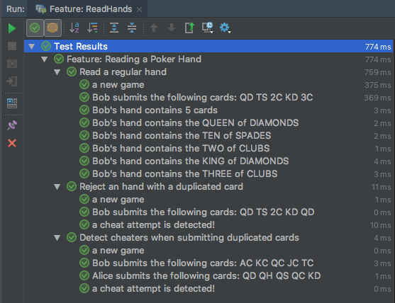

# Step 4: Executing acceptance scenarios

  * Previous step: [Implementing Stories & Tests](./step3.md)

## Using Unit Tests 

## Linking Tests to Stories

The idea here is to work at a better abstraction level and maintain a link between the developed features and the associated automated tests. In addition to JUnit as test engine, we rely on the [Gherkin](https://docs.cucumber.io/gherkin/reference/) language to express acceptance scenarios, and on the [Cucumber](https://cucumber.io/) framework to automate their execution

### :rotating_light: Implementation status

  - The development team has implemented several acceptance scenarios in a cucumber Feature description (`src/test/resources/bdd/ReadHands.feature`);
  - The steps involved in the scenarios are implemented as java methods in the `ScenarioSteps` class (`src/test/java/bdd/ScenarioSteps.java`)
    - :unlock: In a Java regular expression, `^` is the beginning of a line, and `$` the end of a line. 
    - :unlock: To match a pattern and use it as argument for a given step, it must be enclosed between parenthesis. 
    - :unlock: The `.*` pattern will match a `String`, and the `\\d+` one will match an `Integer`.
    - :warning: One can be more clever with respect to pattern description. This is just an overview.
  - The class `RunCucumberTest` (in `src/test/java/bdd`) is used to link the Cucumber engine to classical JUnit tests.

The acceptance scenarios are already executed when running an `mvn clean package`. If your IDE is compatible with Cucumber (check if a plugin exists), you can even obtain syntax highlight, code completion and result interpretation.

<div align="center">





</div> 

### :bangbang: Exercise

  - Extends the `ScenarioSteps` contents to understand the following assertion steps: `Then Bob's highest card is the ACE of CLUBS`
  - Extend the `ReadHands.feature` descriptor to add an acceptance scenario validating story #3.
  - Do the same to support story #4 automated validation

<details>
	<summary>Click to expand code solution (<tt>AcceptanceSteps.java</tt>)</summary>
	
```java
@Then("^(.*)'s highest card is the (.*) of (.*)$")
public void checkHighestCard(String thePlayer, String value, String suit) {
    CardValue v = CardValue.valueOf(value.trim());
    Suit s = Suit.valueOf(suit.trim());
    Card theCard = new Card(v.getSymbol()+""+s.getSymbol());
    Card max = Collections.max(theGame.getByPlayer(thePlayer).getCards());
    assertEquals(theCard, max);
}
```	
	
</details>	  

<details>
	<summary>Click to expand code solution (<tt>AcceptanceSteps.java</tt>)</summary>
	
```cucumber
@Then("^(.*)'s highest card is the (.*) of (.*)$")
public void checkHighestCard(String thePlayer, String value, String suit) {
    CardValue v = CardValue.valueOf(value.trim());
    Suit s = Suit.valueOf(suit.trim());
    Card theCard = new Card(v.getSymbol()+""+s.getSymbol());
    Card max = Collections.max(theGame.getByPlayer(thePlayer).getCards());
    assertEquals(theCard, max);
}
```	
	
</details>	 

  * Next step: [Building a CI stack](./step5.md)