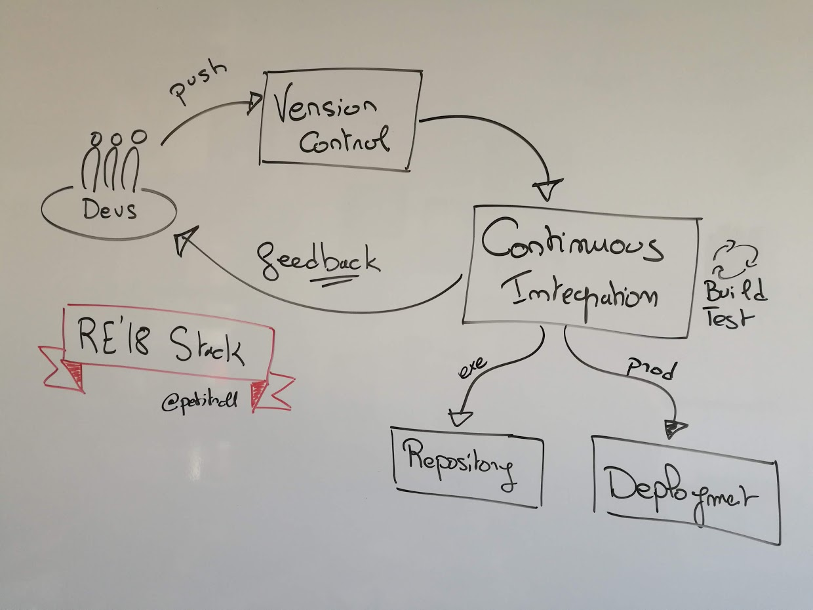

# Step 5: Building a CI stack

  * Previous step: [Executing acceptance scenarios](./step4.md)


## Environment Description

:warning: In this tutorial, we build a state-of-the-art toolchain on top of lightweight tools. Classically companies will rely on more _robust_ tools, which are not compatible with a conference tutorial setup (in terms of required bandwidth, space disk, RAM needs, ...). We then decided to use a light stack you can easily deploy on your computer, and only reference more classical tools that are more complex to configure and setup.

Our objective is the following: _When a developer commits some code, the CI stack is triggered. It retrieves the committed source code, compiles it, runs the tests, and deploys a release of the product freely downloadable by end users._

<div align="center">



</div>

At this step, we will deploy and use the following tools to support this objective:

  - A _Version Control System_ (VCS) for source code. We will rely on git for this purpose, and we deploy a Git server named `gitea`.
    - One can classicaly rely on tools such as github, bitbucket, gitlab, ...
  - A _Continuous Integration_ (CI) server. We will use `drone`, a very light CI tool (written in go). A CI tool is often composed of a main _server_, and a set of _agents_ that will handle the tasks to be done (compiling, running the tests, ...)/
    - Classical CI server are Bamboo, Hudson, Jenkins, ...
  - A _Artifact Repository Manager_ to release our product. Here, we will use a custom tool made on purpose, where we will push new releases using `scp` and expose the releases thanks to an `http` server. 
    -   classical artifacts managers are NPM, Artifactory, Nexus, ...

In the next step, we will go from CI to _Continuous Deployment_ and also releases the poker game product as an executable image.


## Modelling the CI stack

To simplify the deployment, we provide the stack as a _docker compose_ artefact. The stack is described in the `ci/docker-compose.yml` file. 

A docker-compose file is composed of a set of `services`. Each service describes  how to deploy an existing Docker image for this particular stack. It includes a configuration of the network ports (the syntax `xxxx:yyyy` means make available on the host on port `xxxx` the port `yyyy` exposed by the container), and a binding to the local hard drive volumes for persistent data (the syntax  `/local/path:/container/path` means to bind the contents of the `/local/path` volume on your hard drive to a directory named `/container/path` that exists inside the docker container).

### :bangbang: Exercise

  - Look at the contents of the `ci/docker-compose.yml` file. 
  - Can you identify the tools previously described in this file?

## Deploying the stack

First, we need to create a docker network to put all the deployed tools inside the same network and avoid port redirection / visibility issues (which can be a nightmare to solve and require sysadmin knowkledge). 

```
azrael:agile-tutorial mosser$ cd ci
azrael:ci mosser$ docker network create re18-network
af71fc289bc856dc44abaab56fcadca6912cb03c0f7d59860b5a8ca3c9ffb746
azrael:ci mosser$ 
```

Then, you can start the stack by Kindly asking Docker to do so in _daemon_ mode (`-d`). The first time, Docker will automatically download the necessary image on your hard drive, it might take a while (the stack requires ~220Mb of data).

```
azrael:ci mosser$ docker-compose up -d
Creating gitea ... done
Creating drone-server ... done
Creating drone-agent     ... done
Creating release-manager ... done
azrael:ci mosser$
```
When starting up, docker will create two directories: `gitea` and `drone`. These directories are the local volumes used to make persistent the data stored inside the container (without volumes, that stack is transient by default and no data will survive a restart of your containers).

You can see the status of your stack using the following command:

```
azrael:ci mosser$ docker-compose ps
     Name                    Command                  State                             Ports                      
-------------------------------------------------------------------------------------------------------------------
drone-agent       /bin/drone-agent                 Up (healthy)   3000/tcp                                         
drone-server      /bin/drone-server                Up             443/tcp, 80/tcp, 0.0.0.0:8000->8000/tcp, 9000/tcp
gitea             /usr/bin/entrypoint /bin/s ...   Up             22/tcp, 0.0.0.0:3000->3000/tcp                   
release-manager   ./start.sh                       Up             80/tcp, 0.0.0.0:8080->8080/tcp                   
```

:zap: Useful commands for docker:

  - `docker-compose down` will shutdown the stack properly (it might take a while);
  - `docker-compose logs -f` binds your terminal to the log output of the running containers, giving insights of what is happening inside;
  - `docker system prune` will clean your system of remaining containers (not exited normally)
  - `docker system prune -a` will wipe out all data created by docker on your computer, excepting docker itself.


## Configuring the stack

### :bangbang: Exercise: Version Control System setup

We start first by the version control system. The VCS server is exposed on [http://localhost:3000](http://localhost:3000). Since it is not configured yet, accessing this page gets you to the setup form.

  - Fill in the setup form with the following informations:
    - `Application URL`: replace `localhost` by `gitea` (needed by the CI server). 
    - `Admin account setting`: create an admin account for this server. In this tutorial, we assume this user to be named `re18`.
  - :boom: The installation will redirect you to the `http://gitea:3000/user/login` at the end, but unfortunately this URL only exists inside your docker network and is not reachable from your browser. Just replace the `gitea` name by `localhost`in your browser, and it will work like a charm (=> go to [http://localhost:3000/user/login](http://localhost:3000/user/login).
  - Login using your recently created account. 
  - Create a repository by clicking on the blue `+` on the right hand side of the screen. For the rest of this tutorial, we assume this repository to be named `agile-tutorial`

### :bangbang: Exercise: CI Server setup

We now setup the CI server to react when a developer pushes new code to the Gitea server. 

  - Go to your local installation of Drone: [http://localhost:8000](http://localhost:8000)
  - Log into Drone using the admin account created for Gitea. 
    - :interrobang: How is this back magic possible? Look at the `ci/docker-compose.yml` deployment descriptor. Drone is intended to work with various VCS systems, gitea included. Thus, the `drone-server` image is linked to the `gitea` one (` DRONE_GITEA=true`, `DRONE_GITEA_URL=http://gitea:3000`), and drone is then preconfigured to exchange credentials with gitea.
  - Drone lists all the repository available for your account in gitea. 
    - :warning: Drone caches repositories for up to 30 minutes by default. If you create _now_ a new repository on gitea, it might take up to 30 minutes to show up. 
  - To activate the CI stack for the `agile-tutorial`, toggle the button on the right. 
  - Go to the VCS settings page for your repository, in the Webhooks section:
    - [http://localhost:3000/re18/agile-tutorial/settings/hooks](http://localhost:3000/re18/agile-tutorial/settings/hooks)
  - Drone has automatically created a web-hook, meaning that each time a developer push code to gitea, the Drone server will be notified.
  - click on the web hook, and replace `localhost` by `drone-server` (for the same docker-specific reasons we had to rename `localhost` to `gitea` previously). Validate the change by clicking on the green button (`Update Webhook`).

### :bangbang: CI Triggering Exercise
  
  
  - Add the newly created Gitea repository as a new _remote_ repository for your code.
    - `git remote add gitea http://localhost:3000/re18/agile-tutorial.git` 
  - the `git remote` command now returns two remote endpoints: `origin` (this very repository, hosted by github) and `gitea`, your local one.
  - push your code to gitea 
  - Look at your Drone dashboard, the build is automatically started!
    - The CI process will obviously first `clone` the source code, then `build` it, and finally `scp` the result to the release manager.
    - Look at the contents  of the `.drone.yml` file. Can you match the contents of this file with the previously described steps?
  - go to the release manager contents: [http://localhost:8080/releases/](http://localhost:8080/releases/). You should be able to download the latest release produced by the tool.


  * Next step: [From CI to CD](./step6.md)